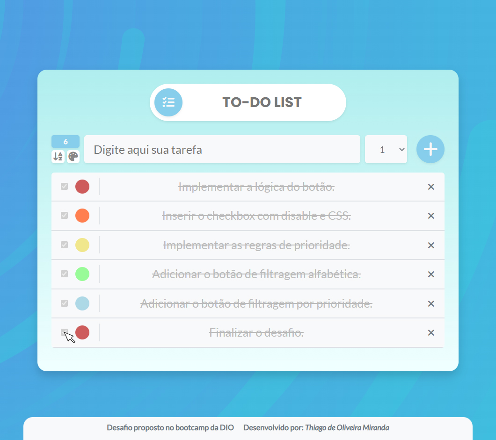
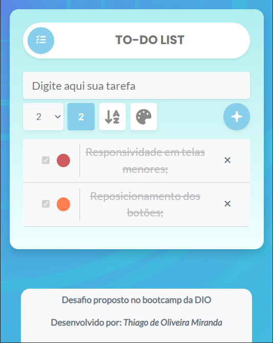

### **DESAFIO PROPOSTO NO BOOTCAMP DA DIO:**

<h2 align="center" color="red" >

***TO-DO LIST***

</h2>

<h3 align="center">

**Criado e desenvolvido por:** *Thiago de Oliveira Miranda*

</h3>

***

 

&emsp;&emsp;O desafio proposto consistia em criar uma ***lista de tarefas*** (*TO-DO LIST*), tendo como premissa a utilização e prática dos métodos ***element.addEventListener( )*** nos botôes. Os conceitos de ***element.createElement( )*** e ***element.setAtrribute( )*** foram explorados para *criar* novos elementos HTML a partir do acionamento do botão de ***Submit***. Para a implementação das regras de geração e inserção de **IDs** o uso de ***querySelector("li").length*** foi implantado para controlar quais ***IDs*** seriam gerados e como parâmetro para selecionar os elementos pai que seriam removidos ao clicar no botão ***close***. Para aplicar a função de remoção o método ***element.remove( )*** foi aplicado no elemento pai das tarefas.

&emsp;&emsp;O escopo também exigia a implementação de regras de manipulação de atributos dos elementos da página ***DOM*** (*Documento Object Model*) através dos métodos ***getElement*** e ***querySelector***. Por fim o atributo de CSS: ***text-decoration: line-through*** é aplicado atráves da marcação da ***checkbox***.

 

***

 

### **Resultado esperado:**

 

Figura 01: Lista de Tarefas

 

***

 

<h2 align="center">

  **MELHORIAS IMPLEMENTADAS**

</h2>

### **Resultado obtido:**

 

Figura 02: Resultado do desafio.

 

Figura 02: Versão para dispositivos móveis.

 

* [x]  Identificador de quantidade de tarefas;
* [x]  ***Form-selector*** para seleção de níveis de prioridade das tarefas de 01 a 05 com escala tonal;           
* [x]  Regras condicionais que impedem a adição de tarefas sem escopo e sem classificação;
* [x]  Botão de filtro para a ordenação alfabética;
* [x]  Botão de filtro para a ordenação em escala de prioridade;
* [x]  Animações nos botôes de ***Submit*** e ***Close***;
* [x]  Condição que desabilita o ***Checkbox*** da tarefa quando concluída;
* [x]  Responsividade para telas menores e dispositivos móveis;
* [x]  O design e a disposição dos botões muda para adequar a funcionalidade para tablets e celulares;

 

***

